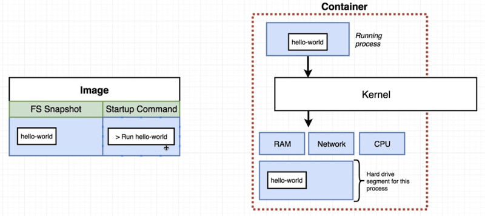
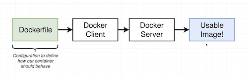
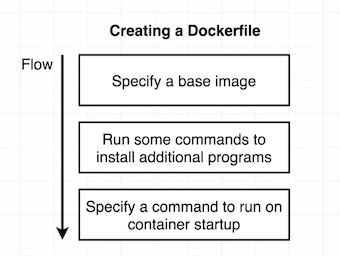
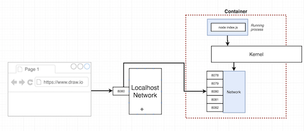
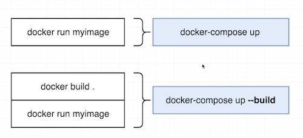
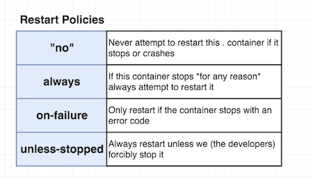

Docker image
-----



Docker commands
-----
**Create and run docker container with an image:**
```
docker run <image name>     ->     docker create <image name> + docker start -a <container id>
```
When container is created default command can't be changed. So start the second time same container means that same command will be executed on start.


**List running containers:**
```
docker ps (--all)
```


**Remove all stopped containers, cashes (all that is downloaded from docker hub), and etc.**
```
docker system prune
```


**Retrieve log outputs:**
```
docker logs <container id>
```


**Stop docker container:**
```
docker stop <container id>     ->     (SIGTERM to process)
```

```
docker kill <container id>     ->     (SIGKILL)
```


**Execute commands in running container:**
```
docker exec -it <container id> <command>     ->     -i = input (STDIN) -t = beautify output
```

            
**Linux processes communication channels:**

STDIN | STDOUT | STDERR
--- | --- | ---


-i flag from exec connects to the STDIN.


**Terminal access inside container context:**
```
docker exec -it <container id> sh
```

**Building docker image**



**Create docker file**

>Writing a Dockerfile it's like you being given a computer without OS and being asked to install Chrome




Dockerfile
---
```
#Use existing docker image as a base
FROM alpine

#Download and install dependencies
RUN apk add --update redis

#On startup container
CMD ["redis-server"]
```

**Build docker image**
```
docker build .     ->     '.'  - build context
docker build -f Dockerfile.dev .     -> -f <file_name>
```

On the *RUN* step: 1) new temporary image will be build with primary command `apk add --update redis` -> **image1** 2) **container1** will be shut down on the completion. 
On the *CMD* step: 1) new temporary image will be created again with FS Snapshot from the **image1** and `redis-server` will be set as a primary command -> **image2**.
2) **container2** will be shut down 3) final **image3** will be produced.  

**Tag an image**
```
docker build -t <dockerId>/<projectName>:<version> .     ->     ... -t gwenu/redis:latest...
```

**Manual image generation out of container**
```
docker commit -c 'CMD ["redis-server"]' <container id>      ->      will generate image
```

**Docker images library:**
[Docker Hub](https://hub.docker.com/)

**Copy files**
```
COPY ./ ./     ->     
1) Path to folder to copy from on your machine relative to build context 
2) place to copy stuff to inside the container
```

**Port mapping**



```
docker run -p 8080:8080 <image id>      ->     ... -p [port local host]:[port inside container]
```

**Specifying a Working Directory**
```
WORKDIR /usr/app     ->     Any following command will be executed relative to this path in the container (as well as all docker exec ...)
```

**Docker Compose Files**
Automate running set of commands: docker-compose.yml
Docker Compose make the connections between the all services define and the name of the service can be used as an URL to reach other container.
 

 
**Run Docker containers in the background with docker-compose and stop**
```
docker-compose up -d
docker-compose down
``` 
 

 
**Container status with Docker Compose**
```
 docker-compose ps
```
 
**Docker Volumes (references to resources on the local env - dev mode)**
```
docker run -it -p 3000:3000 -v /app/node_modules/ -v $(pwd):/app CONTAINER_ID     -> '-v /app/node_modules/' do not override this folder
```
 
 
 