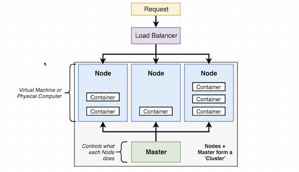
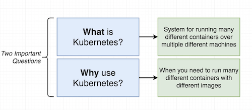
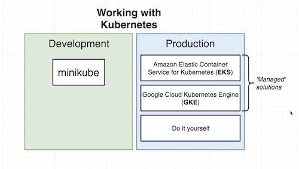
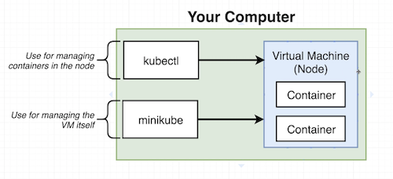
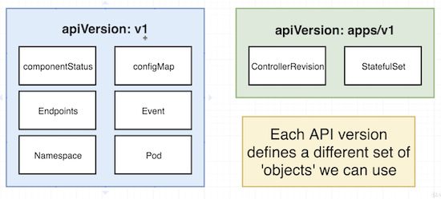
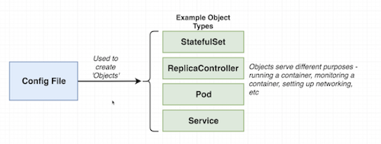
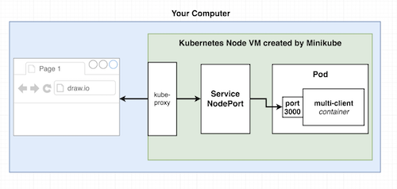

Kubernetes Cluster
-----



Communication through **Master**





**Kubernetes on local environment**



```
minikube start
kubectl cluster-info
```

**Config files explained**

```
client-pod.yaml
------
apiVersion: v1
kind: Pod
metadata: 
  name: client-pod
  labels:
    components: web
spec: 
  containers:
    - name: client
      image: poluektova/multi-client
      ports:
        - containerPort: 3000
   
        
        
client-node-port.yaml
------     
apiVersion: v1
kind: Service
metadata: 
  name: client-node-port
spec:
  type: NodePort
  ports:
    - port: 3050
      targetPort: 3000
      nodePort: 31515
  selector:
    component: web
```





**Pods** runs one or more closely related container.  
**Services** - (ClusterIP, NodePort(mainly dev purposes), LoadBalancer, Ingress) - sets up networking in a Kubernetes Cluster.  



Service linked with Pod by selector (in Service) - labels (in Pod) -> 'component: web'.

**Feed a config file to Kubectl**
```
kubectl apply -f <filename>
```

**Print the status of all running pods/services**
```
kubectl get pods
kubectl get services
```

**Address of VM**
```
minikube ip
```
