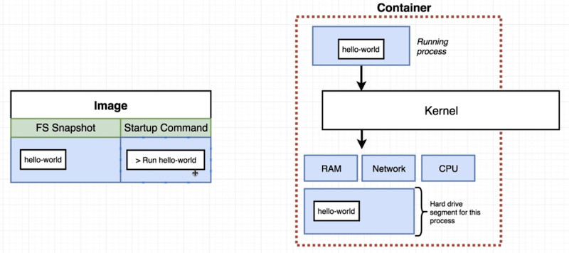
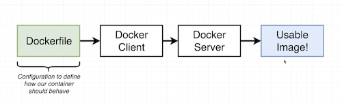
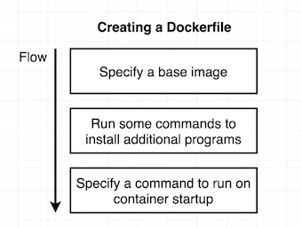

Docker image
-----



Docker commands
-----
**Create and run docker container with an image:**
```
docker run <image name>     ->     docker create <image name> + docker start -a <container id>
```
When container is created default command can't be changed. So start the second time same container means that same command will be executed on start.


**List running containers:**
```
docker ps (--all)
```


**Remove all stopped containers, cashes (all that is downloaded from docker hub), and etc.**
```
docker system prune
```


**Retrieve log outputs:**
```
docker logs <container id>
```


**Stop docker container:**
```
docker stop <container id>     ->     (SIGTERM to process)
```

```
docker kill <container id>     ->     (SIGKILL)
```


**Execute commands in running container:**
```
docker exec -it <container id> <command>     ->     -i = input (STDIN) -t = beautify output
```

            
**Linux processes communication channels:**

STDIN | STDOUT | STDERR
--- | --- | ---


-i flag from exec connects to the STDIN.


**Terminal access inside container context:**
```
docker exec -it <container id> sh
```

**Building docker image**



**Create docker file**




Dockerfile
---
```
#Use existing docker image as a base
FROM alpine

#Download and install dependencies
RUN apk add --update redis

#On startup container
CMD ["redis-server"]
```

**Build docker image**
```
docker build .     ->     '.'  - build context
```


 
 
 